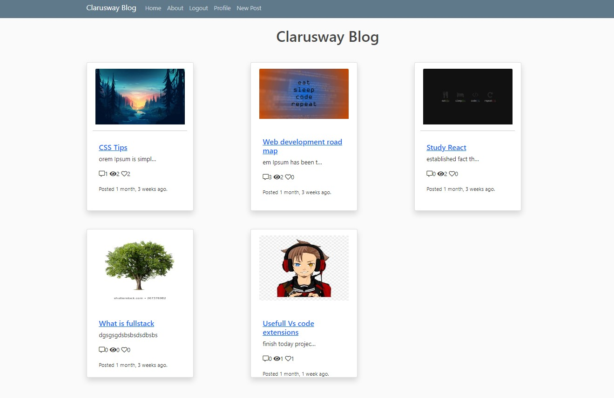
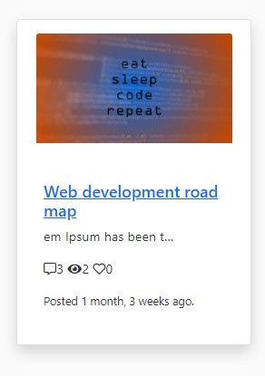
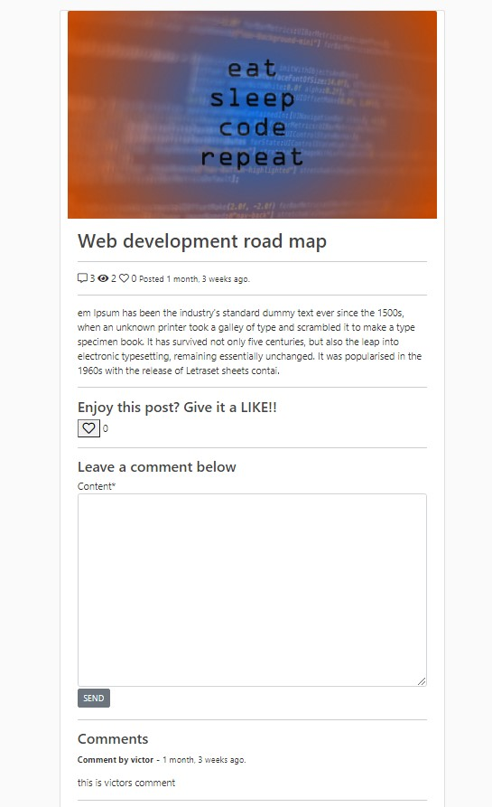
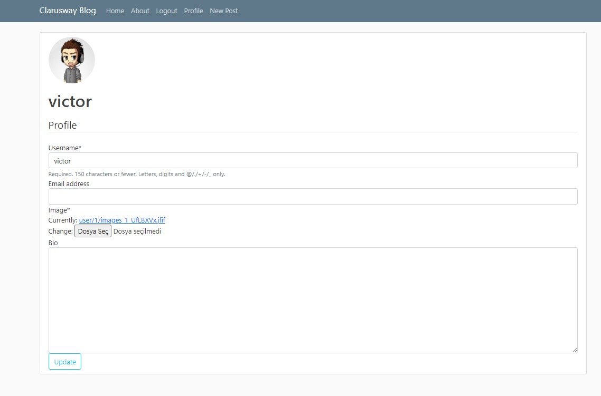
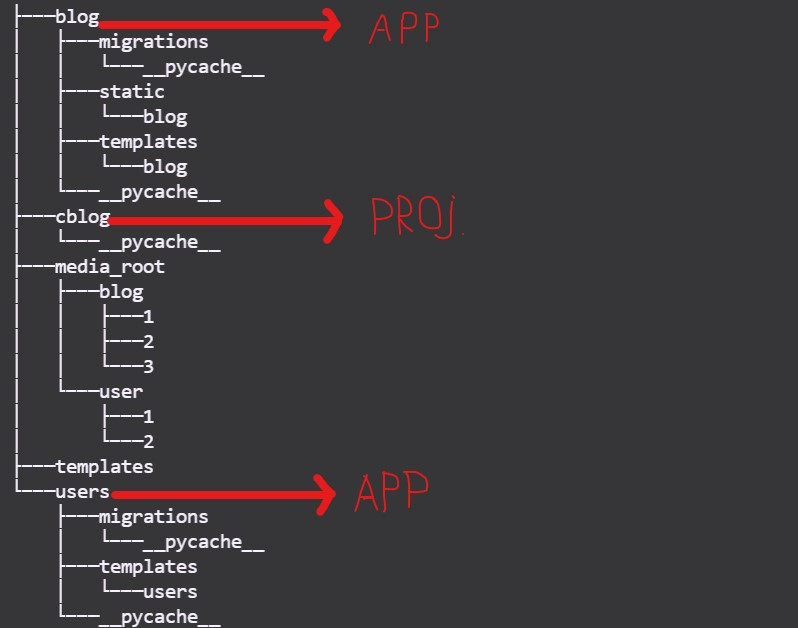
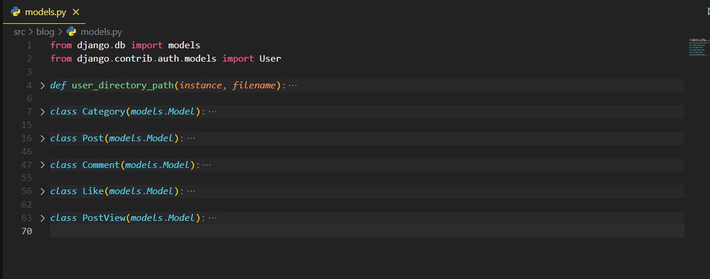

<p>Clarusway</p>

# Project : Django Blog Project

## Description

Let's create a blog project where users can create posts and publish them on the blog page.You can see a sample blog page in the picture below.



## Problem Statement

- Our project will have registration and login features for users.
- Users will be able to see the main blog page we mentioned above regardless of whether they are logged in or not.
- Users will be able to see the details by clicking on the post.
- Login users will be able to create new posts, update and comment on other people's posts.

### NavBar ( Logout Users)


### NavBar ( Login Users)


### Post Fields
- image
- title	
- Content (abbreviated form)
- Comment-view-like count icons
- Publist date



### Post Detail Fields
- image
- title	
- Full content
- Comment-view-like count icons
- Like button
- Comment area
- Comments ( with comment owner and comment date)
- Update and Delete Buttons (Only  Visibly to Post Owners )


### Profile
- When a user register the profile of that user will be automatically created.  Users can update their profiles.


### Authentication and authorization : 

Users can be register with their username- email and password. There shoud be forget password option in the login page.
	
Login Users : 
- Users can see the blog page.
- Users can see the post details
- Like the posts
- comment in the post detail
- create post
- update and delete own posts
    
Logout Users :
- Users can see the blog page.
- Users can see the post details (except for comments)

## Project Skeleton





## Expected Outcome


## Objective

### At the end of the project, following topics are to be covered;

- Creating django project 

- Views

- Templates

- Forms

- Signals

- Authentication and authorization


## Tips for Solution

- We can use Bootstrap in Templates

- We can create 2 apps in our project, one app for post operations and one app for user operations.

- When you coding your blog app model you can benefit from the structure shown in the picture below

 

- Here is the list of packages and dependencies for project
```
asgiref==3.3.1
autopep8==1.5.4
cffi==1.14.4
cryptography==3.3.1
dj-database-url==0.5.0
dj-rest-auth==2.1.3
Django==3.1.4
django-cors-headers==3.6.0
django-crispy-forms==1.10.0
django-heroku==0.3.1
djangorestframework==3.12.2
gunicorn==20.0.4
Pillow==8.0.1
psycopg2==2.8.6
pycodestyle==2.6.0
pycparser==2.20
python-decouple==3.3
pytz==2020.5
six==1.15.0
sqlparse==0.4.1
toml==0.10.2
whitenoise==5.2.0
```


## Notes

- Please use Githup for your projects !
- Save your critical information in your .env file

**<p align="center">&#9786; Happy Coding &#9997;</p>**
